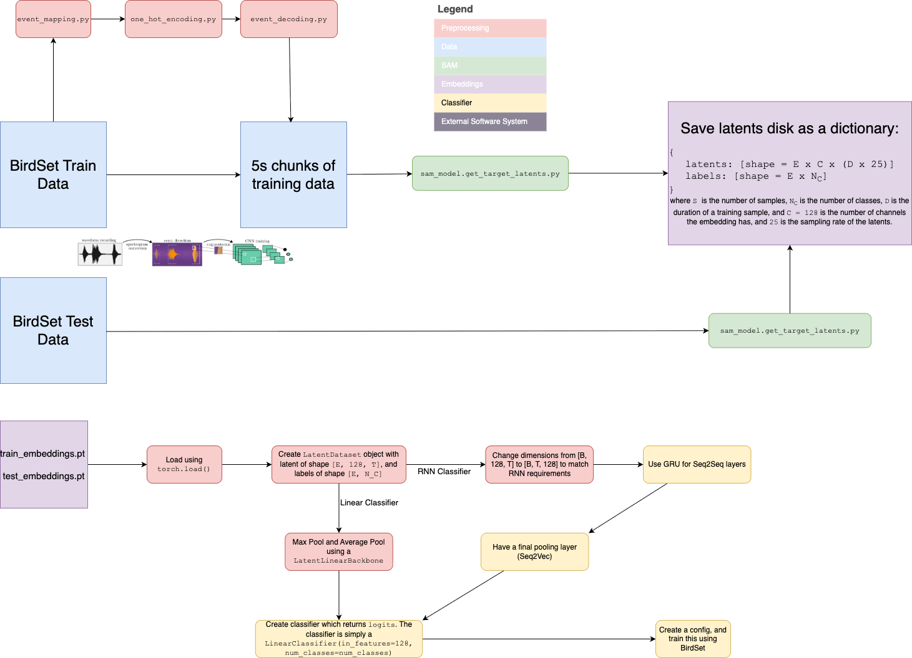

# SAM-Audio BirdSet Latent Pipeline

This repository is a fork of the upstream SAM-Audio project, adapted for a BirdSet-based latent-classification workflow.

The main purpose of this fork is to use SAM-Audio as a feature extractor instead of only treating it as a direct source-separation model. BirdSet samples are chunked, passed through the SAM-Audio model, and the resulting target latents are saved as reusable tensors for downstream multilabel bird-audio classification.

## Why this fork exists

This project focuses on the following pipeline:

- load BirdSet data and prepare fixed-length 5s chunks
- encode each chunk with the SAM-Audio model
- store latent tensors and multi-hot labels as a compact `.pt` archive
- train a downstream classifier over the latent representation
- sweep pooling and learning hyperparameters to compare model architectures

In other words, the fork turns SAM-Audio into a latent feature backbone for ecological audio classification.

## Architecture



The architecture follows a simple pattern:

1. BirdSet train and test datasets are converted into audio chunks.
2. Each chunk is passed through SAM-Audio latent extraction.
3. Latent tensors are saved as a dictionary with the schema:
   `{"latents": [E, C, D, T], "labels": [E, N_C]}`
4. A latent classifier is trained with pooling strategies such as mean, max, mean+max, or GRU-based temporal pooling.
5. Model quality is measured with multilabel metrics such as mAP and AUROC.

## Repository layout

- `latent_pipeline/` — latent generation, training, and visualization scripts
- `evaluation/` — metric implementations and evaluation utilities
- `docs/` — project notes and workflow documentation
- `notebooks/` — exploratory notebooks
- `apply_sam/` — older preprocessing scripts kept for reference
- `sam_audio/` — upstream SAM-Audio model and processor code
- `examples/` — official SAM-Audio prompting examples

## Main workflow

### 1) Generate latent representations

```bash
python latent_pipeline/generate_latents.py \
  --train_path /path/to/train_dataset \
  --test_path /path/to/test_dataset \
  --output_dir /path/to/output \
  --model sam-audio-base \
  --description "bird audio" \
  --batch_size 8
```

This saves latent tensors and labels in a compact format that can be reused across training runs.

### 2) Train a classifier on the latents

```bash
python latent_pipeline/train_latents.py \
  --train_path /path/to/train_latents.pt \
  --test_path /path/to/test_latents.pt \
  --pooling mean_max \
  --num_epochs 20 \
  --lr 5e-4
```

### 3) Sweep hyperparameters

```bash
python latent_pipeline/sweep_latents.py \
  --train_path /path/to/train_latents.pt \
  --test_path /path/to/test_latents.pt \
  --poolings mean,max,mean_max,gru \
  --num_epochs_list 10,20,30 \
  --lrs 1e-4,5e-4,1e-3 \
  --hidden_dims 256,1024 \
  --output_csv sweep_results.csv
```

### 4) Visualize latent structure

```bash
python latent_pipeline/visualize_latents.py \
  --latents_path /path/to/train_latents.pt \
  --output_dir /path/to/plots \
  --method both
```

## What the code does

The main logic is split across:

- `latent_pipeline/generate_latents.py` — converts BirdSet entries into fixed-length chunks and extracts SAM-Audio target latents
- `latent_pipeline/dataset_latents.py` — dataset wrapper for loading saved latent archives
- `latent_pipeline/classifier_latents.py` — latent classifiers with configurable pooling and normalization
- `latent_pipeline/train_latents.py` — train/eval loop for the latent-space classifier
- `latent_pipeline/sweep_latents.py` — hyperparameter sweep across pooling, learning rate, hidden size, and epochs
- `evaluation/metrics.py` — multilabel mAP and AUROC metric implementations

## Setup

Requirements:

- Python >= 3.11
- CUDA-compatible GPU recommended
- access to the upstream SAM-Audio checkpoints on Hugging Face

Install dependencies:

```bash
pip install .
```

If you are using the upstream SAM-Audio model checkpoints, authenticate to Hugging Face before running the latent extraction pipeline.

## Upstream context

This repository is based on the original SAM-Audio project from Meta AI. The upstream work is a general-purpose audio segmentation foundation model that uses text, visual, and temporal prompts to isolate target sounds in mixtures.

This fork builds on that foundation by treating SAM-Audio as a feature extractor for BirdSet-style downstream audio classification tasks.

## Project notes

Additional documentation is available under the [docs](docs) directory:

- [docs/001-generate-latents.md](docs/001-generate-latents.md)
- [docs/002-visualize-latents.md](docs/002-visualize-latents.md)
- [docs/003-dataset-latents.md](docs/003-dataset-latents.md)
- [docs/004-train-latents.md](docs/004-train-latents.md)
- [docs/005-classifier-latents.md](docs/005-classifier-latents.md)
- [docs/006-sweep-latents.md](docs/006-sweep-latents.md)

## Contributing

See [CONTRIBUTING.md](CONTRIBUTING.md) and [CODE_OF_CONDUCT.md](CODE_OF_CONDUCT.md) for project guidelines.

## License

This project is licensed under the SAM License. See [LICENSE](LICENSE).

## Citing the upstream model

If you use the upstream SAM-Audio model in your research, please cite the original paper:

```bibtex
@article{shi2025samaudio,
    title={SAM Audio: Segment Anything in Audio},
    author={Bowen Shi and Andros Tjandra and John Hoffman and Helin Wang and Yi-Chiao Wu and Luya Gao and Julius Richter and Matt Le and Apoorv Vyas and Sanyuan Chen and Christoph Feichtenhofer and Piotr Doll{\'a}r and Wei-Ning Hsu and Ann Lee},
    year={2025},
    url={https://arxiv.org/abs/2512.18099}
}
```
